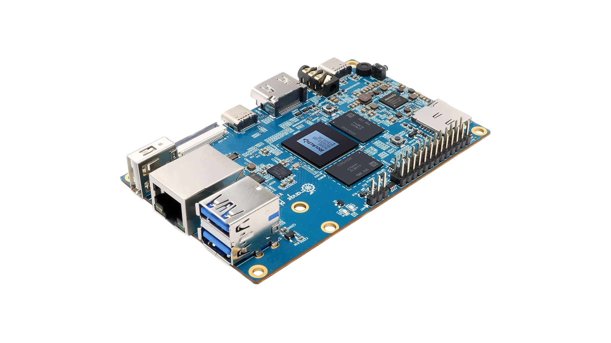
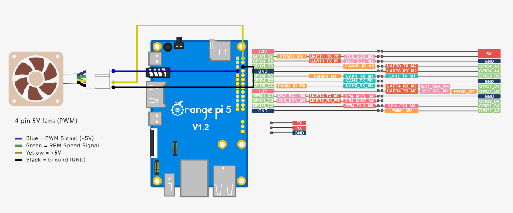

# Orange Pi 5

**Orange Pi** – это свободно помещающийся на ладони одноплатный компьютер, созданный на базе мобильного микропроцессора ARM. Он обладает низким энергопотреблением и может работать даже от солнечных батарей.

Технические характеристики:

- Вес – 46 грамм.
- Тактовая частота 2.4 ГГц.
- Графическое ядро Arm Mali-G610 MP4 “Odin.
- оперативная память – 4/8/16 Гб.
- 1 порт USB 3.0, 2 порта USB 2.0, 1 порт Type-C
- HDMI-порт.

Схема распиновки (pinout)

В Клевере Orange Pi подключается к полетному контроллеру и используется как вспомогательный компьютер. Он позволяет [подключаться к дрону по Wi-Fi](wifi.md), программировать автономные полеты, работать с периферией и многое другое.

**Далее**: [образ для Orange Pi](image.md).
