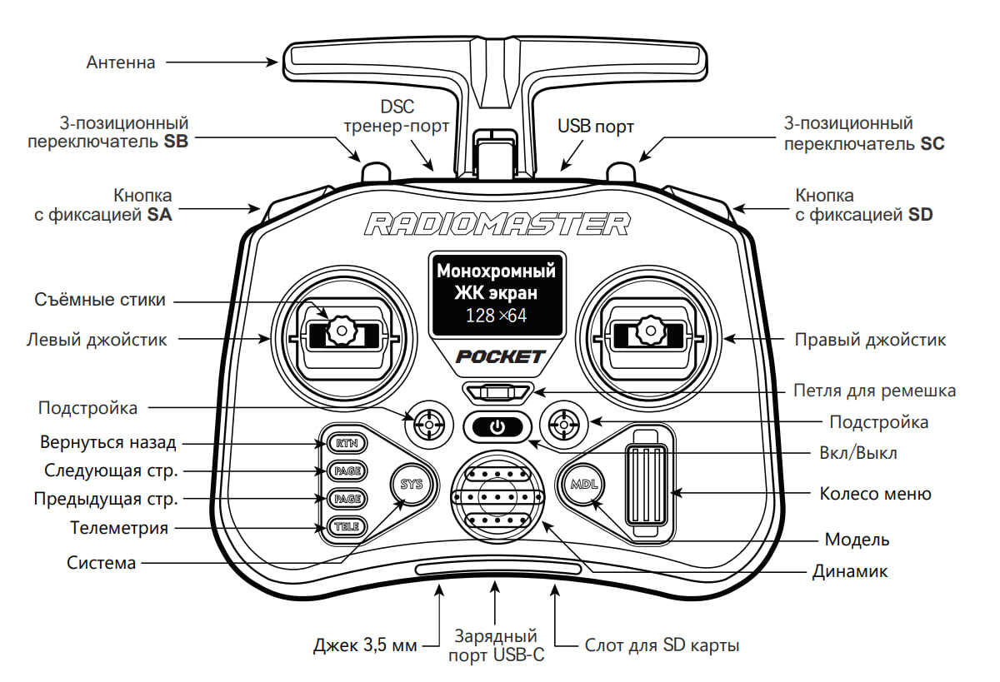
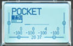

# Настройка пульта

Перед подключением пульта убедитесь, что:

* К коптеру не подключено внешнее питание АКБ.
* Пропеллеры не установлены на моторах.

## Подключение пульта

1. В программе QGroundControl перейдите в панель *Vehicle Configuration* и выберите меню *Radio*.

2. Включите пульт, зажав кнопку питания. (При влючении пульта убедитесь что левый стик газа опущен в минимальное положение и все тумблеры направлены от вас)

3. Убедитесь, что связь с приемником установлена.

    На ЖК Экране пульта высвечивается индикация:

    

    Светодиод на приемнике должен гореть непрерывно зеленым. При наличии проблем с подключением читайте статью "[Неисправности радиоаппаратуры](radioerrors.md)".

**Далее**: [Настройка полетных режимов](modes.md).
