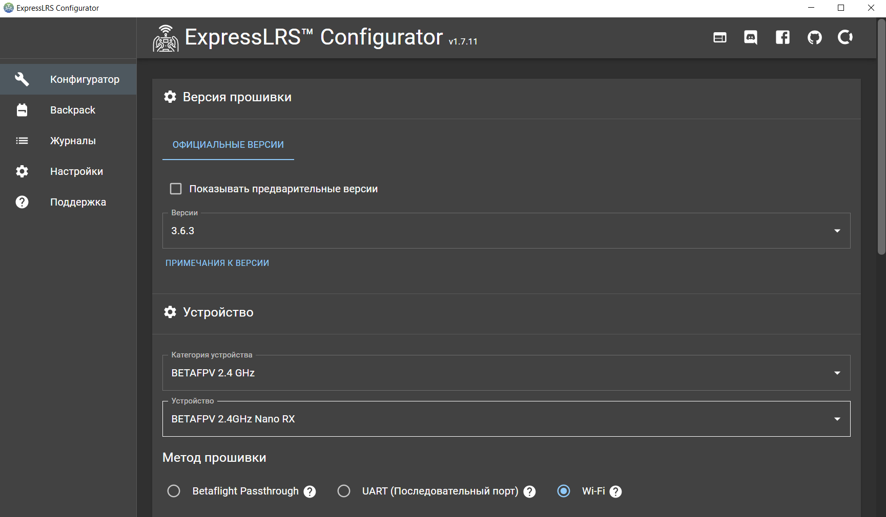
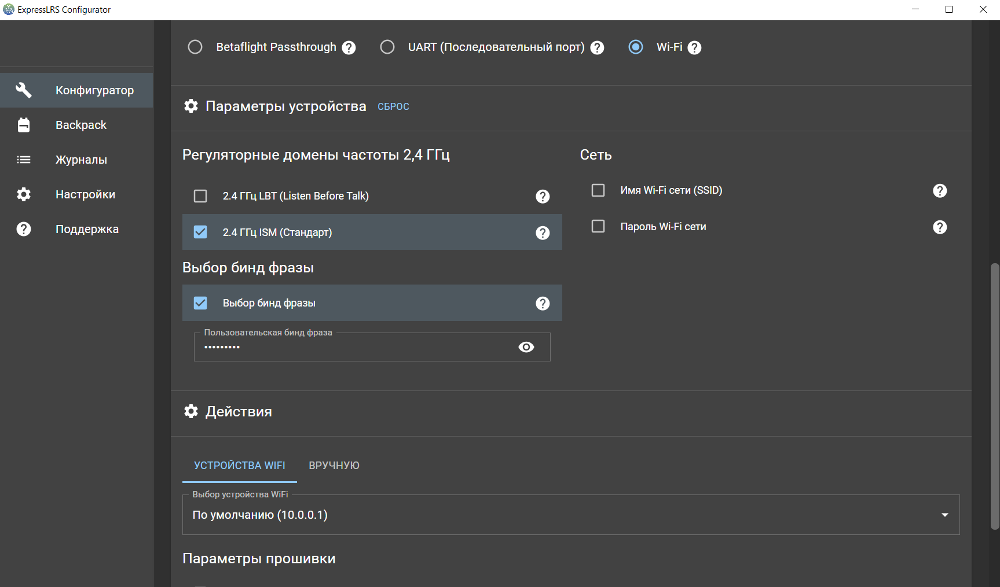
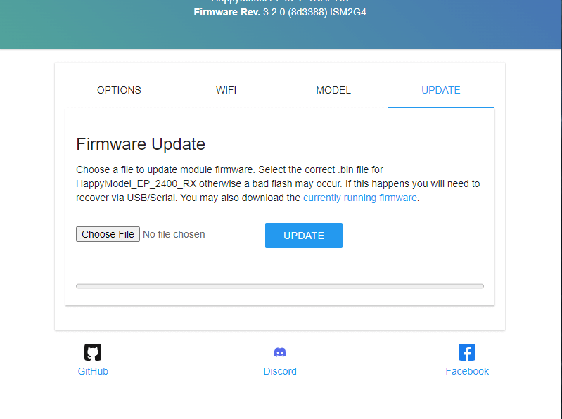
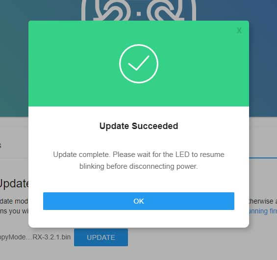
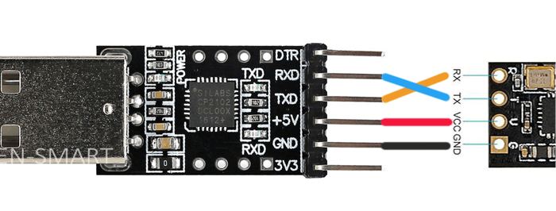
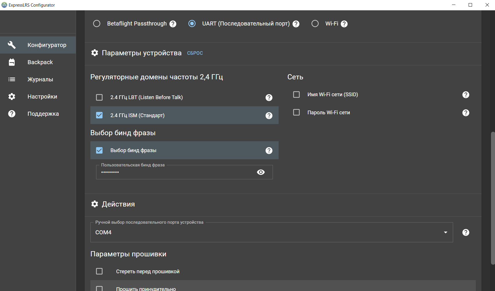

# Привязка приёмника с пультом 

Есть 2 способа зашить бинд-фразу в приёмник: 
1.  Через wi-fi
2.  Через USB-TTL

Рассмотрим оба способа 

### Через Wi-Fi

Скачиваем приложение [ExpresseLRS Configurator](https://github.com/ExpressLRS/ExpressLRS-Configurator/releases)

Во вкладке конфигуратор на главной странице приложения:

1.  Выбираем самую новую версию прошивки

2.  Выберите категорию устройства и целевое устройство, соответствующее вашему оборудованию.

    Категория устройства: ```BETAFPV 2.4 GHz```

    Устройство: ```BETAFPV 2.4GHz Nano RX```

    

3.  Устанавливаем для метода прошивки значение ```Wi-Fi```

5.  В категории "Регуляторные домены частоты 2,4 ГГц" - ```2.4 ГГц ISM (стандарт)```

6.  Прописываем бинд-фразу (фраза должна быть одинаковой на всех ваших устройствах, иначе они не будут привязаны или синхронизированы)



7.  Нажимаем кнопку "собрать" и сохраняем файл на устройстве, с которого будем прошивать

После завершения процесса сборки должно открыться окно с временной папкой, содержащей двоичные файлы прошивки. Не закрывайте эту временную папку, так как в ней вы будете хранить прошивку на следующих этапах.

Переводим ресивер в режим Wi-Fi

1.  Включаем приёмник

    Если для питания приёмника вам придётся подключить LiPo:

    -   убедитесь, что вы проверили подключение.

    -   убедитесь, что на видеопередатчик (VTX) поступает воздух. Вы также можете временно отключить его от полётного контроллера.

    Если он уже включен и подключен или синхронизирован с модулем TX, сначала выключите радио и модуль TX, а затем перезагрузите (выключите, а затем снова включите) приемник.

2.  Подождите не менее 60 секунд, и светодиод начнет либо быстро мигать, либо светиться зеленым (для приемников с RGB-светодиодом), указывая на то, что устройство перешло в режим Wi-Fi.

3.  Теперь, когда ресивер находится в режиме Wi-Fi и может подключаться к вашей локальной сети Wi-Fi, откройте окно браузера на любом устройстве с поддержкой Wi-Fi, которое также подключено к той же локальной сети Wi-Fi. Введите адрес [http://elrs_rx.local](http://elrs_rx.local) в адресной строке браузера. Должен загрузиться веб-интерфейс ExpressLRS.

4.  Активируйте вкладку ```Update```

    

    Прокрутите страницу вниз, чтобы найти раздел «Обновление прошивки».

5.  Перетащите файл прошивки из папки Temp в поле «Загрузить файл».

6.  Нажмите кнопку ```Update```, чтобы начать процедуру обновления.

7.  Дождитесь, пока файл прошивки будет загружен и установлен на ваше устройство. Это займёт всего минуту или две, после чего вы увидите всплывающее окно с сообщением об успешном завершении.

    

Через несколько секунд светодиодный индикатор на приёмнике должен снова начать медленно мигать.

### Через UART

Скачиваем приложение [ExpresseLRS Configurator](https://github.com/ExpressLRS/ExpressLRS-Configurator/releases)

1.  Подключите приёмник к адаптеру UART, как показано на изображении ниже.

    

2.  Нажмите и удерживайте кнопку включения на приёмнике

3.  Подключите UART-адаптер к USB-порту компьютера.

    Как только светодиод на приёмнике загорится постоянно, отпустите/снимите давление с кнопки на приёмнике, если она есть.

4.  Проверьте, правильно ли определяется ваш UART-адаптер как устройство USB-to-UART. (Пользователи Windows могут проверить это в диспетчере устройств, в группе устройств «Порты».)

5. Запустите конфигуратор ExpressLRS на своём компьютере.

6.  Во вкладке конфигуратора выбираем самую новую версию прошивки

7.  Выберите категорию устройства и целевое устройство, соответствующее вашему оборудованию.

    Категория устройства: ```BETAFPV 2.4 GHz```

    Устройство: ```BETAFPV 2.4GHz Nano RX```

    

8.  Устанавливаем для метода прошивки значение ```UART```

    

9.  Нажмите кнопу Flash

10. Дождитесь завершения процесса. В конфигураторе ExpressLRS появится зелёная полоса «Успешно».

11. Через несколько секунд светодиодный индикатор на приёмнике должен снова начать медленно мигать.

